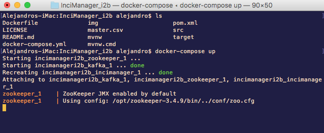

[](https://www.codacy.com/app/alejgh/InciManager_i2b?utm_source=github.com&amp;utm_medium=referral&amp;utm_content=Arquisoft/InciManager_i2b&amp;utm_campaign=Badge_Grade)
[](https://travis-ci.org/Arquisoft/InciManager_i2b)
[](https://circleci.com/gh/Arquisoft/InciManager_i2b)
[](https://codecov.io/gh/Arquisoft/InciManager_i2b)


# InciManager_i2b

## Authors
- Alejandro González Hevia (@alejgh)
- Carmen Sors González (@carmee-en)
- Alvaro Tejido Jardón (@tejido18)
- Eduardo Ulibarri Toledo (@uo251436)

## How to execute the module
There are two different possibilities in order to run the Incident Manager.

### Using Docker (recommended)
In order to run the module using Docker you just need to install just one dependency: Docker itself. You can download Docker from their [official site](https://www.docker.com/community-edition#/download).

Once you installed docker you have to start the Docker daemon and open a new command line if you are on Mac or Linux, or just open the Docker quickstart terminal if you are on Windows. After that, you execute `docker-compose up` inside the root directory of the Manager, where the docker-compose.yml file is located.

Once you execute this command, Docker Compose will launch three containers:
* A container running zookeper on port 2181.
* A container running kafka on port 9092.
* A container running the Incidence Manager application, listening on port 8081.



The first time you run docker-compose up will take quite a bit of time, because it needs to pull several images in order to run the application (zookeper, kafka and maven). Once the images are pulled they are cached by docker, so the next time you run the application it won't download the images again, taking less than a minute to start all the containers.

Once the application is running you can connect to it using http://localhost:8081 if you are running on Mac or Linux. If you are running it on Windows you will have to use the private IP specified when you start running Docker:


Finally, when you are done using the application, you can use Ctrl+C to gracefully stop all the containers run by Docker:


### Without using Docker
If you want to run the Incidence Manager without using Docker you will need to setup Kafka and Zookeper manually, as well as running the spring boot application using Maven.

#### Kafka
First of all, you need to download Apache Kafka.

---tar -xzf kafka_2.11-1.0.1.tgz

---cd kafka_2.11-1.0.1

Before starting Apache Kafka, as it uses Zookeeper, you need to first start a ZooKeeper server if you don't already have one. You can use a script packaged with kafka to get a quick single-node ZooKeeper instance.

---bin\windows\zookeeper-server-start.bat config/zookeeper.properties

Now, you can start the Kafka server.

---bin\windows\kafka-server-start.bat config/server.properties

#### Mongo DB
This is the database of the system, to run it you have to go to the folder where you downloaded it and then run it.

---bin/mongod —port 27018

#### Maven
To run the application with maven, you have to run Apache Kafka and Mongo DB before. Then you have to go to the projects folder(where you have the pom.xml file) and type:

---mvn spring-boot:run

## Posting a new Incident
Once you have the Incident Manager application up and running you can create a new Incident by sending a POST request to http://localhost:8081/incident/create. The format of the incident must be like this one:.
```json
{
  "agent": {
    "username": "sonny",
  	"password": "pass123",
    "kind": "Person"
  },
  "inciName": "My first incidence",
  "location": {
    "lat": 43.30,
    "lon": -5.68
  },
  "tags": ["Fire", "Important"],
  "moreInfo": ["myImage.jpg"],
  "properties": {
    "priority": 1,
    "temperature": "50ºC",
    "operators": ["Paco", "Carmen"]
  }
}
```
Inside the properties JSON object you can include any object you want.

You will need to have the [Agents_i2b module](https://github.com/Arquisoft/Agents_i2b) running in order to create the Incident, since the system has to check if the Agent exists before creating the incident.

## Querying the incidents of an agent
With you application running, you may need to query and list the incidents of a certain agent and retrieve these both in JSON format or with a more visual web interface.

### Retrieving incidents in JSON format
You can get the list of incidents by sending a post request to http://localhost:8081/incidentsinfo (or, in case you are using Docker, as said before, you may send the request to port 8001). The request body must contain the following parameters:
* username: Username of the agent
* password: Password of the agent
* kind: Kind of the agent

The output format will be as follows:
```
{
  "agent": {
    "username": "agentUsername",
    "password": "agentPassword",
    "kind": "agentKind"
  },
  "inciName": "incidentName",
  "location": {
    "lat": 1,
    "lon": 1
  },
  "tags": [
    "tag1",
    "tag2"
  ],
  "moreInfo": [
    "moreInfo1",
    "moreInfo2"
  ],
  "properties": {
    
  }
}
```
### Web interface
For a more visual output, you may also sent a get request to http://localhost:8081/agentform that will lead you to a sample form where you must specify the agent's username, password and kind:


You can enter the following credentials to test the interface:
```
username: sonny
password: pass123
kind: Person
```

In case wrong login data is provided, an error message will pop up, else the agent's incidents will be displayed as follows:


You can also access a chat based interface to create an incident instead of doing a POST request. This interface can be accessed from the incidents view after you log in, or going directly to http://localhost:8081/incident/create.
